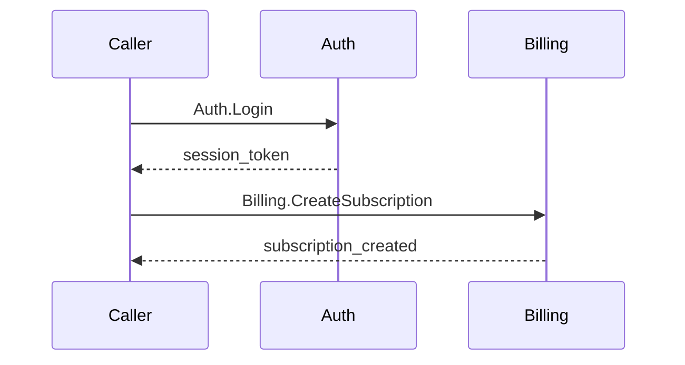

<objective>
Create test fixtures that validate all FLOW requirements: schema files with e2eFlows flag for all 3 project types, a cross-component E2E flow file for the microservice fixture, and updated fixture specs with structured Dependencies format.

Purpose: Prove FLOW-01 (opt-in via schema flag), FLOW-02 (skip when disabled), FLOW-03 (universal terminology in flows), and FLOW-04 (hash-based change detection with universal structure) through concrete fixtures following the Phase 13 test fixture pattern.
Output: 4 new files + 3 modified files in tests/fixtures/verification/.
</objective>

<execution_context>
@$HOME/.claude/get-shit-done/workflows/execute-plan.md
@$HOME/.claude/get-shit-done/templates/summary.md
</execution_context>

<context>
@.planning/PROJECT.md
@.planning/ROADMAP.md
@.planning/STATE.md
@.planning/phases/14-cross-unit-flows/14-CONTEXT.md
@.planning/phases/14-cross-unit-flows/14-RESEARCH.md

<interfaces>
<!-- Existing fixture file formats that new files must be consistent with -->

From tests/fixtures/verification/microservice/specs/INDEX.md:
```markdown
## E2E Flows

No E2E flows.
```
(This "No E2E flows." text must be replaced with a populated table.)

From tests/fixtures/verification/microservice/specs/auth/context.md:
```markdown
## Dependencies
Requires User component for profile lookup.
```
(This free-text prose must be replaced with structured bold-entry format.)

From tests/fixtures/verification/microservice/specs/billing/context.md:
```markdown
## Dependencies
Requires Auth component for caller identity.
```
(This free-text prose must be replaced with structured bold-entry format.)

From agents/e2e-flows.md -- Flow file 5-section format:
1. Title and Description
2. Step Table (6 columns: #, From, To, Action, Data, Ref)
3. Sequence Diagram (Mermaid)
4. Error Paths (5 columns: #, At Step, Condition, Response, Ref)
5. Spec References (3 columns: Component, Section, Hash)

From agents/e2e-flows.md -- Spec References column header:
"Component" (not "Service")

From tools/schema-parser.ts -- Schema meta e2eFlows:
Parsed from Meta table `e2e-flows` key, defaults to `false`.

From tests/fixtures/verification/microservice/specs/auth/context.md -- Auth sections (api-gateway override):
Overview, Public Interface, Authentication, Rate Limiting, Error Handling, Dependencies, Configuration

From tests/fixtures/verification/microservice/specs/billing/context.md -- Billing sections (default):
Overview, Public Interface, Domain Model, Behavior Rules, Error Handling, Dependencies, Configuration

From tests/fixtures/verification/microservice/specs/auth/cases.md -- Auth operations:
Auth.Login, Auth.RefreshToken

From tests/fixtures/verification/microservice/specs/billing/cases.md -- Billing operations:
Billing.CreateSubscription, Billing.CancelSubscription
</interfaces>
</context>

<tasks>

<task type="auto">
  <name>Task 1: Create schema fixture files for all 3 project types</name>
  <files>
    tests/fixtures/verification/microservice/consolidation.schema.md,
    tests/fixtures/verification/cli/consolidation.schema.md,
    tests/fixtures/verification/library/consolidation.schema.md
  </files>
  <read_first>
    - docs/examples/schema-microservice.md (reference schema format with e2eFlows=true)
    - docs/examples/schema-cli.md (reference schema format)
    - tests/fixtures/verification/microservice/specs/INDEX.md (verify component names: auth with type api-gateway, billing with no type)
    - tests/fixtures/verification/cli/specs/INDEX.md (verify component names: init, config -- both untyped)
    - tests/fixtures/verification/library/specs/INDEX.md (verify component names: parser, emitter -- both untyped)
    - tools/schema-parser.ts (lines 25-35 and 75-80 -- e2eFlows parsing, meta table format)
  </read_first>
  <action>
**Create microservice schema** at `tests/fixtures/verification/microservice/consolidation.schema.md` with this exact content:

```markdown
# Consolidation Schema

A component is the smallest independently specifiable unit in your project.

## Meta

| Key | Value |
|-----|-------|
| version | 1 |
| rule-prefix | CR |
| e2e-flows | true |

## Components

| Component | Description | Type |
|-----------|-------------|------|
| auth | Authentication and session management | api-gateway |
| billing | Subscription and payment processing | |

## Sections: default

### Context Sections
1. **Overview** -- What this component does and why it exists
2. **Public Interface** -- Operations, commands, endpoints, or API surface this component exposes to consumers
3. **Domain Model** -- Entities, types, and data structures this component owns
4. **Behavior Rules** -- Business rules, constraints, and invariants governing this component's behavior
5. **Error Handling** -- Error categories, failure modes, and recovery strategies
6. **Dependencies** -- What this component requires from other components or external systems
7. **Configuration** -- Environment variables, feature flags, and tunable parameters

### Conditional Sections
- **State Lifecycle** -- Include when: component manages stateful entities with lifecycle transitions
- **Event Contracts** -- Include when: component produces or consumes events/messages

## Sections: api-gateway

### Context Sections
1. **Overview** -- What this gateway component does and why it exists
2. **Public Interface** -- Routes, middleware chains, and API surface exposed to external consumers
3. **Authentication** -- Token validation, session management, and identity resolution
4. **Rate Limiting** -- Throttling rules, quota management, and abuse prevention
5. **Error Handling** -- Error response formats, status code mapping, and client-facing error contracts
6. **Dependencies** -- Upstream services, identity providers, and external integrations
7. **Configuration** -- Environment variables, feature flags, and tunable parameters
```

Key: Components table matches existing fixture specs/ directories exactly (auth with type api-gateway, billing untyped). `e2e-flows` is `true`. The api-gateway section override matches auth/context.md's actual section headings.

**Create CLI schema** at `tests/fixtures/verification/cli/consolidation.schema.md` with this exact content:

```markdown
# Consolidation Schema

A component is the smallest independently specifiable unit in your project.

## Meta

| Key | Value |
|-----|-------|
| version | 1 |
| rule-prefix | CR |
| e2e-flows | false |

## Components

| Component | Description | Type |
|-----------|-------------|------|
| init | Project scaffolding and initialization | |
| config | Configuration management and persistence | |

## Sections: default

### Context Sections
1. **Overview** -- What this component does and why it exists
2. **Public Interface** -- Operations, commands, endpoints, or API surface this component exposes to consumers
3. **Domain Model** -- Entities, types, and data structures this component owns
4. **Behavior Rules** -- Business rules, constraints, and invariants governing this component's behavior
5. **Error Handling** -- Error categories, failure modes, and recovery strategies
6. **Dependencies** -- What this component requires from other components or external systems
7. **Configuration** -- Environment variables, feature flags, and tunable parameters

### Conditional Sections
- **State Lifecycle** -- Include when: component manages stateful entities with lifecycle transitions
- **Event Contracts** -- Include when: component produces or consumes events/messages
```

Key: Components match existing cli fixture (init, config, both untyped). `e2e-flows` is `false`. No specs/e2e/ directory exists or is created for CLI.

**Create library schema** at `tests/fixtures/verification/library/consolidation.schema.md` with this exact content:

```markdown
# Consolidation Schema

A component is the smallest independently specifiable unit in your project.

## Meta

| Key | Value |
|-----|-------|
| version | 1 |
| rule-prefix | CR |
| e2e-flows | false |

## Components

| Component | Description | Type |
|-----------|-------------|------|
| parser | Input parsing and AST construction | |
| emitter | Output code generation and serialization | |

## Sections: default

### Context Sections
1. **Overview** -- What this component does and why it exists
2. **Public Interface** -- Operations, commands, endpoints, or API surface this component exposes to consumers
3. **Domain Model** -- Entities, types, and data structures this component owns
4. **Behavior Rules** -- Business rules, constraints, and invariants governing this component's behavior
5. **Error Handling** -- Error categories, failure modes, and recovery strategies
6. **Dependencies** -- What this component requires from other components or external systems
7. **Configuration** -- Environment variables, feature flags, and tunable parameters

### Conditional Sections
- **State Lifecycle** -- Include when: component manages stateful entities with lifecycle transitions
- **Event Contracts** -- Include when: component produces or consumes events/messages
```

Key: Components match existing library fixture (parser, emitter, both untyped). `e2e-flows` is `false`.

**Validate all 3 schemas parse correctly** by running:
```bash
deno run --allow-read tools/schema-parser.ts tests/fixtures/verification/microservice/consolidation.schema.md
deno run --allow-read tools/schema-parser.ts tests/fixtures/verification/cli/consolidation.schema.md
deno run --allow-read tools/schema-parser.ts tests/fixtures/verification/library/consolidation.schema.md
```

Confirm: microservice schema has `e2eFlows: true`, cli and library schemas have `e2eFlows: false`. All parse without errors.
  </action>
  <verify>
    <automated>deno run --allow-read tools/schema-parser.ts tests/fixtures/verification/microservice/consolidation.schema.md 2>&1 | grep -q "e2eFlows" && deno run --allow-read tools/schema-parser.ts tests/fixtures/verification/cli/consolidation.schema.md 2>&1 | grep -q "e2eFlows" && deno run --allow-read tools/schema-parser.ts tests/fixtures/verification/library/consolidation.schema.md 2>&1 | grep -q "e2eFlows" && echo "ALL SCHEMAS VALID"</automated>
  </verify>
  <acceptance_criteria>
    - tests/fixtures/verification/microservice/consolidation.schema.md exists and contains `| e2e-flows | true |`
    - tests/fixtures/verification/cli/consolidation.schema.md exists and contains `| e2e-flows | false |`
    - tests/fixtures/verification/library/consolidation.schema.md exists and contains `| e2e-flows | false |`
    - Microservice schema Components table lists `auth` with type `api-gateway` and `billing` with empty type
    - CLI schema Components table lists `init` and `config` both with empty type
    - Library schema Components table lists `parser` and `emitter` both with empty type
    - All 3 schemas parse successfully via schema-parser.ts (no errors in output)
    - Microservice schema parser output shows `e2eFlows: true`
    - CLI and library schema parser outputs show `e2eFlows: false`
  </acceptance_criteria>
  <done>All 3 project type fixtures have parseable schema files. Microservice has e2eFlows=true, CLI and library have e2eFlows=false. Component names match existing fixture directories exactly.</done>
</task>

<task type="auto">
  <name>Task 2: Create E2E flow fixture, update Dependencies format, and populate INDEX.md</name>
  <files>
    tests/fixtures/verification/microservice/specs/e2e/auth-billing-flow.md,
    tests/fixtures/verification/microservice/specs/auth/context.md,
    tests/fixtures/verification/microservice/specs/billing/context.md,
    tests/fixtures/verification/microservice/specs/INDEX.md
  </files>
  <read_first>
    - tests/fixtures/verification/microservice/specs/auth/context.md (current file -- Dependencies section to update)
    - tests/fixtures/verification/microservice/specs/billing/context.md (current file -- Dependencies section to update)
    - tests/fixtures/verification/microservice/specs/auth/cases.md (operations: Auth.Login, Auth.RefreshToken -- needed for flow Ref column)
    - tests/fixtures/verification/microservice/specs/billing/cases.md (operations: Billing.CreateSubscription, Billing.CancelSubscription -- needed for flow Ref column)
    - tests/fixtures/verification/microservice/specs/INDEX.md (current file -- E2E Flows section to update)
    - agents/e2e-flows.md (full file -- 5-section flow format, Step Table columns, Spec References format, quality gate)
  </read_first>
  <action>
**Step 1: Compute real hashes for Spec References.**

Run hash-sections.ts on the auth and billing spec files to get actual hash values:
```bash
deno run --allow-read tools/hash-sections.ts tests/fixtures/verification/microservice/specs/auth/context.md tests/fixtures/verification/microservice/specs/auth/cases.md tests/fixtures/verification/microservice/specs/billing/context.md tests/fixtures/verification/microservice/specs/billing/cases.md
```

Record the hash values for these specific sections (needed for the flow file's Spec References table):
- auth/context.md: Overview
- auth/cases.md: Auth.Login
- billing/context.md: Overview
- billing/cases.md: Billing.CreateSubscription

**Step 2: Create the E2E flow file.**

Create directory `tests/fixtures/verification/microservice/specs/e2e/` and file `auth-billing-flow.md` with this content (substitute `{hash}` placeholders with actual hashes from Step 1):

```markdown
# Auth-Billing Flow

User creates a premium subscription requiring authentication and billing.

## Step Table

| # | From | To | Action | Data | Ref |
|---|------|----|--------|------|-----|
| 1 | caller | auth | Auth.Login | credentials | auth/cases.md#Auth.Login |
| 2 | auth | billing | Billing.CreateSubscription | user_id, plan | billing/cases.md#Billing.CreateSubscription |

## Sequence Diagram



## Error Paths

| # | At Step | Condition | Response | Ref |
|---|---------|-----------|----------|-----|
| E1 | 1 | Invalid credentials | invalid_credentials (InvalidCredentials) | auth/cases.md#Auth.Login F1 |
| E2 | 2 | Payment fails | payment_failed (PaymentFailed) | billing/cases.md#Billing.CreateSubscription F1 |

## Spec References

| Component | Section | Hash |
|-----------|---------|------|
| auth/context.md | Overview | {hash-from-step-1} |
| auth/cases.md | Auth.Login | {hash-from-step-1} |
| billing/context.md | Overview | {hash-from-step-1} |
| billing/cases.md | Billing.CreateSubscription | {hash-from-step-1} |
```

Critical format requirements:
- Column header is "Component" (not "Service") per e2e-flows.md quality gate
- All 6 Step Table columns populated for every row
- Sequence diagram participants match Step Table (Caller, Auth, Billing)
- Error Paths Ref column points to specific failure cases (F1) from cases.md
- Hash values are real computed hashes, not placeholders
- File name is hyphen-separated lowercase: `auth-billing-flow.md`
- No "service" terminology anywhere in the file -- only "component", "caller", component names

**Step 3: Update auth/context.md Dependencies section.**

In `tests/fixtures/verification/microservice/specs/auth/context.md`, replace the Dependencies section:

Current (line 27):
```markdown
## Dependencies
Requires User component for profile lookup.
```

Replace with:
```markdown
## Dependencies
- **billing** -- payment processing for premium account upgrades
```

Note: Changed from "User component" to "billing" because billing is the other component in this fixture. The flow file documents the auth->billing cross-component interaction. This makes the Dependencies section consistent with the flow file's participants.

**Step 4: Update billing/context.md Dependencies section.**

In `tests/fixtures/verification/microservice/specs/billing/context.md`, replace the Dependencies section:

Current (line 25):
```markdown
## Dependencies
Requires Auth component for caller identity.
```

Replace with:
```markdown
## Dependencies
- **auth** -- caller identity and session validation
```

**Step 5: Update INDEX.md E2E Flows section.**

In `tests/fixtures/verification/microservice/specs/INDEX.md`, replace the E2E Flows section:

Current (lines 12-14):
```markdown
## E2E Flows

No E2E flows.
```

Replace with:
```markdown
## E2E Flows

| Flow | Description | Components | File |
|------|-------------|------------|------|
| Auth-Billing Flow | User creates a premium subscription requiring authentication and billing | auth, billing | [auth-billing-flow](e2e/auth-billing-flow.md) |
```

**Step 6: Verify hash-sections.ts can process the new flow file.**

Run:
```bash
deno run --allow-read tools/hash-sections.ts tests/fixtures/verification/microservice/specs/e2e/auth-billing-flow.md
```

Confirm it produces valid JSON output with section hashes for the flow file's H2 sections (Step Table, Sequence Diagram, Error Paths, Spec References).
  </action>
  <verify>
    <automated>test -d tests/fixtures/verification/microservice/specs/e2e && grep "## Step Table" tests/fixtures/verification/microservice/specs/e2e/auth-billing-flow.md && grep "## Spec References" tests/fixtures/verification/microservice/specs/e2e/auth-billing-flow.md && grep '**billing**' tests/fixtures/verification/microservice/specs/auth/context.md && grep '**auth**' tests/fixtures/verification/microservice/specs/billing/context.md && grep "auth-billing-flow" tests/fixtures/verification/microservice/specs/INDEX.md && deno run --allow-read tools/hash-sections.ts tests/fixtures/verification/microservice/specs/e2e/auth-billing-flow.md | grep -q "hash" && deno test tools/ --allow-read && echo "ALL CHECKS PASS"</automated>
  </verify>
  <acceptance_criteria>
    - Directory tests/fixtures/verification/microservice/specs/e2e/ exists
    - tests/fixtures/verification/microservice/specs/e2e/auth-billing-flow.md exists
    - Flow file contains all 5 required sections: title block, "## Step Table", "## Sequence Diagram", "## Error Paths", "## Spec References"
    - Flow file Step Table has 6 columns (From, To, Action, Data, Ref) with 2 data rows
    - Flow file Spec References column header is "Component" (not "Service")
    - Flow file Spec References Hash column contains 8-character hex hashes (not placeholders)
    - Flow file contains zero occurrences of the word "service" (case-insensitive grep)
    - auth/context.md Dependencies section contains `- **billing** -- payment processing for premium account upgrades`
    - auth/context.md Dependencies section does NOT contain "Requires User component"
    - billing/context.md Dependencies section contains `- **auth** -- caller identity and session validation`
    - billing/context.md Dependencies section does NOT contain "Requires Auth component"
    - INDEX.md E2E Flows section contains a table row with "auth-billing-flow"
    - INDEX.md does NOT contain "No E2E flows."
    - hash-sections.ts processes the flow file and produces valid JSON with section hashes
    - `deno test tools/ --allow-read` passes all 19 existing tests
    - No specs/e2e/ directory exists in cli/ or library/ fixtures
  </acceptance_criteria>
  <done>Microservice fixture has complete E2E flow infrastructure: schema with e2eFlows=true, structured Dependencies in both component specs, populated E2E flow file with real hashes, and INDEX.md with flow table. CLI and library fixtures have no e2e directory, validating skip behavior. All existing tests pass.</done>
</task>

</tasks>

<verification>
- `deno test tools/ --allow-read` -- all 19 existing tests pass
- `deno run --allow-read tools/schema-parser.ts tests/fixtures/verification/microservice/consolidation.schema.md` -- parses with e2eFlows=true
- `deno run --allow-read tools/schema-parser.ts tests/fixtures/verification/cli/consolidation.schema.md` -- parses with e2eFlows=false
- `deno run --allow-read tools/schema-parser.ts tests/fixtures/verification/library/consolidation.schema.md` -- parses with e2eFlows=false
- `deno run --allow-read tools/hash-sections.ts tests/fixtures/verification/microservice/specs/e2e/auth-billing-flow.md` -- produces valid JSON
- `grep -ri "service" tests/fixtures/verification/microservice/specs/e2e/` -- returns 0 matches (no service terminology)
- `test ! -d tests/fixtures/verification/cli/specs/e2e` -- no e2e directory for CLI
- `test ! -d tests/fixtures/verification/library/specs/e2e` -- no e2e directory for library
- `grep '**billing**' tests/fixtures/verification/microservice/specs/auth/context.md` -- structured Dependencies
- `grep '**auth**' tests/fixtures/verification/microservice/specs/billing/context.md` -- structured Dependencies
</verification>

<success_criteria>
1. All 3 project types have parseable schema files with correct e2eFlows flag values
2. Microservice fixture has specs/e2e/auth-billing-flow.md following the 5-section format
3. Flow file uses universal terminology (component, not service) throughout
4. Flow file Spec References contain real computed hashes from hash-sections.ts
5. Auth and billing fixture specs use structured Dependencies with bold component names
6. INDEX.md E2E Flows section is populated with the flow file reference
7. CLI and library fixtures have no specs/e2e/ directory (skip path validation)
8. All 19 existing deno tests remain green
</success_criteria>

<output>
After completion, create `.planning/phases/14-cross-unit-flows/14-02-SUMMARY.md`
</output>
