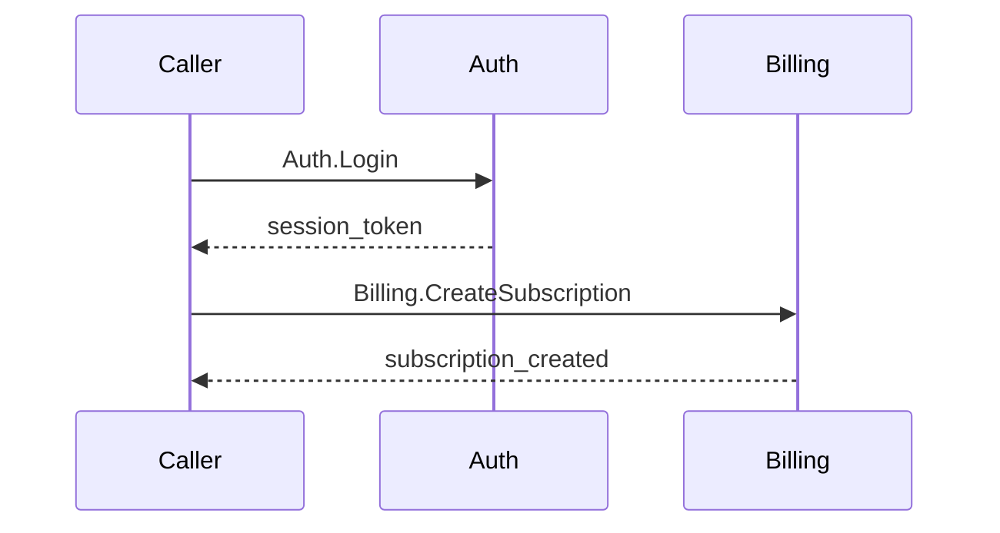

# Phase 14: Cross-Unit Flows - Research

**Researched:** 2026-04-02
**Domain:** Test fixture extension, agent bias fix, Dependencies section structuring, IMPL-SPEC reference cleanup
**Confidence:** HIGH

## Summary

Phase 14 validates FLOW-01 through FLOW-04 (E2E flow generation opt-in, skip behavior, universal terminology, hash-based change detection) through test fixtures and targeted fixes to 6 files. This is not a greenfield implementation phase -- the E2E flow pipeline already works. The work is validation-via-fixtures (following the Phase 13 pattern) plus 3 small fixes: one bias removal in e2e-flows.md, Dependencies section structuring across 3 files (~10 lines total), and IMPL-SPEC reference cleanup in 2 external files.

The existing test fixture infrastructure at `tests/fixtures/verification/` has 3 project types (microservice, cli, library) with 15 files. Phase 14 extends the microservice fixture with `e2eFlows=true` schema and `specs/e2e/` flow file, while CLI and library fixtures remain `e2eFlows=false` to validate skip logic. The microservice fixture already has cross-component Dependencies (auth->billing) making it a natural E2E flow candidate.

All decisions are locked in CONTEXT.md (D-01 through D-12). The technical surface is narrow: no new tools, no new agents, no new parsing logic. The hash-sections.ts and schema-parser.ts tools are verified working and need no changes. The e2e-flows.md agent is complete except for one word change on line 52.

**Primary recommendation:** Structure as 2-3 small plans: (1) fixture extension + schema files for FLOW validation, (2) e2e-flows.md bias fix + Dependencies structuring + IMPL-SPEC cleanup. Each plan touches well-defined, non-overlapping files.

<user_constraints>
## User Constraints (from CONTEXT.md)

### Locked Decisions
- **D-01:** FLOW-01~04 validated via test fixtures following the Phase 13 pattern. Extend existing `tests/fixtures/verification/` directory.
- **D-02:** Microservice fixture extended with `e2eFlows=true` schema and `specs/e2e/` flow file. auth->billing dependency provides natural cross-component scenario.
- **D-03:** CLI and library fixtures remain `e2eFlows=false`, used to verify skip logic (FLOW-02).
- **D-04:** IMPL-SPEC.md is NOT deleted in Phase 14. It is archived together with other `.planning/` artifacts by `/gsd:complete-milestone`.
- **D-05:** External references to IMPL-SPEC (docs/STACK.md: 3 locations, CLAUDE.md: 1 location) are updated in Phase 14 to point to current authoritative sources.
- **D-06:** `.planning/` internal references (56 files) are left unchanged as historical artifacts.
- **D-07:** Phase 14 focuses exclusively on FLOW validation and identified fixes. Milestone-level cleanup handled by `/gsd:complete-milestone`.
- **D-08:** Dependencies section in MODEL.md gains a structured format for explicit cross-component references.
- **D-09:** spec-consolidator.md updated to follow structured dependency format when writing Dependencies sections.
- **D-10:** SKILL.md Step 3.5 updated to parse structured dependency entries instead of scanning natural language.
- **D-11:** Step Table template in `agents/e2e-flows.md` line 52: `{operation or HTTP call}` changed to `{operation}`.
- **D-12:** SKILL.md's current "check flag -> skip if false" approach for E2E content (~30 lines) is sufficient.

### Claude's Discretion
- Exact structured dependency format syntax (bullet style, separator character)
- Test fixture content details (component names, operation names, flow narrative)
- IMPL-SPEC reference replacement text in docs/STACK.md and CLAUDE.md
- Test fixture directory organization within `tests/fixtures/verification/`

### Deferred Ideas (OUT OF SCOPE)
- **IMPL-SPEC.md deletion** -- Archived with `/gsd:complete-milestone`, not deleted in Phase 14.
- **Per-component Dependencies detail level** -- How much detail each dependency entry needs. Left to discretion for now.
</user_constraints>

<phase_requirements>
## Phase Requirements

| ID | Description | Research Support |
|----|-------------|------------------|
| FLOW-01 | E2E flow generation is opt-in via schema flag (not default) | schema-parser.ts line 77 defaults `e2eFlows` to `false`. Validated via microservice fixture (`e2eFlows=true`) vs cli/library fixtures (`e2eFlows=false`). Fixture schema files demonstrate the flag. |
| FLOW-02 | Orchestrator skips flow steps when E2E is disabled | SKILL.md lines 173-175 implement skip logic ("If false: Skip Steps 3.5 and 4 entirely"). CLI and library fixtures with `e2eFlows=false` validate the skip path. |
| FLOW-03 | When enabled, flow agent uses universal unit terminology | e2e-flows.md already uses "component" throughout (column headers, participant labels, dispatch contract). One bias remains: "HTTP call" on line 52 -- fixed per D-11. Microservice fixture with `specs/e2e/` flow file validates universal terminology. |
| FLOW-04 | Hash-based change detection works with universal unit structure | hash-sections.ts is path-agnostic (processes any file path). e2e-flows.md Spec References table uses `{component}/context.md` paths -- already universal. Microservice fixture with hash values in flow file validates detection. |
</phase_requirements>

## Standard Stack

No new libraries or tools. Phase 14 works entirely within the existing codebase:

| Tool | Version | Purpose | Status |
|------|---------|---------|--------|
| Deno | 2.7.9 | Runtime for hash-sections.ts, schema-parser.ts | Verified installed |
| unified | 11.0.5 | Markdown AST pipeline | No changes needed |
| remark-parse | 11.0.0 | Markdown parser | No changes needed |
| remark-gfm | 4.0.0 | GFM table parsing | No changes needed |
| deno test | built-in | Test runner | 19 existing tests pass |

## Architecture Patterns

### Fixture Extension Pattern (from Phase 13)

Phase 13 established the test fixture pattern: minimal `specs/` structures per project type with structural differentiation (microservice triggers certain checks, CLI/library do not).

**Current fixture structure:**
```
tests/fixtures/verification/
  microservice/
    specs/
      auth/context.md, cases.md
      billing/context.md, cases.md
      INDEX.md
  cli/
    specs/
      init/context.md, cases.md
      config/context.md, cases.md
      INDEX.md
  library/
    specs/
      parser/context.md, cases.md
      emitter/context.md, cases.md
      INDEX.md
```

**Phase 14 additions:**
```
tests/fixtures/verification/
  microservice/
    consolidation.schema.md     # NEW: e2eFlows=true, 2 components
    specs/
      e2e/                      # NEW: E2E flow directory
        auth-billing-flow.md    # NEW: Cross-component flow file
      auth/context.md           # MODIFIED: structured Dependencies
      billing/context.md        # MODIFIED: structured Dependencies
      INDEX.md                  # MODIFIED: E2E Flows section populated
  cli/
    consolidation.schema.md     # NEW: e2eFlows=false
  library/
    consolidation.schema.md     # NEW: e2eFlows=false
```

### Structured Dependencies Format

The Dependencies section in component specs currently uses free-text prose:
```markdown
## Dependencies
Requires Auth component for caller identity.
```

D-08 introduces a structured format. Recommended syntax (Claude's discretion on exact format):
```markdown
## Dependencies
- **auth** -- caller identity and session validation
```

This format is consistent with the existing section formatting patterns in MODEL.md (bold name + description separated by ` -- `). It mirrors the context section definition format (`**Name** -- description`). SKILL.md Step 3.5 can parse these deterministically by looking for `**{component-name}**` in bold.

**Affected files for format definition:**
1. `docs/MODEL.md` section #6 (Dependencies) -- add structured format specification
2. `agents/spec-consolidator.md` -- update output format for Dependencies section
3. `skills/consolidate/SKILL.md` Step 3.5 -- update parsing instruction from "scan natural language" to "parse bold entries"

**Affected fixtures for format adoption:**
4. `tests/fixtures/verification/microservice/specs/auth/context.md` -- update Dependencies
5. `tests/fixtures/verification/microservice/specs/billing/context.md` -- update Dependencies

### E2E Flow File Structure

From `agents/e2e-flows.md`, a flow file at `specs/e2e/{flow-name}.md` contains exactly 5 sections:
1. Title and Description
2. Step Table (6 columns: #, From, To, Action, Data, Ref)
3. Sequence Diagram (Mermaid)
4. Error Paths
5. Spec References (Component, Section, Hash)

The fixture flow file must follow this exact format to be valid for V-29 verification.

### IMPL-SPEC Reference Replacement Strategy

4 external references need updating:

| File | Line | Current Text | Replacement Target |
|------|------|--------------|-------------------|
| `docs/STACK.md` | 62 | `per IMPL-SPEC` | `per MODEL.md` (model assignments are documented in MODEL.md Meta section) |
| `docs/STACK.md` | 74 | `(from IMPL-SPEC)` | `(from MODEL.md)` |
| `docs/STACK.md` | 130 | `IMPL-SPEC explicitly rejected` | Rephrase to standalone statement (the rejection rationale stands on its own) |
| `CLAUDE.md` | 58 | `docs: update IMPL-SPEC with review findings` | Replace with a different commit example using a current file |

These are text-only changes with no behavioral impact. The authoritative source for agent model assignments is now MODEL.md and the agent frontmatter files themselves.

## Don't Hand-Roll

| Problem | Don't Build | Use Instead | Why |
|---------|-------------|-------------|-----|
| Schema parsing | Custom parser for fixture schemas | `tools/schema-parser.ts` | Already handles all cases including e2eFlows flag |
| Section hashing | Manual hash computation | `tools/hash-sections.ts` | Path-agnostic, deterministic output format |
| E2E flow format | Ad-hoc flow documentation | `agents/e2e-flows.md` format spec | 5-section format with quality gate |
| Dependency parsing | Regex/NLP scanning | Structured bold-entry format | Deterministic parse vs. unreliable NLP |

## Common Pitfalls

### Pitfall 1: Fixture Schema Must Match Existing Fixture Structure
**What goes wrong:** Creating a schema file that declares components not present in the fixture's specs/ directory, or vice versa.
**Why it happens:** The fixture schemas are new (Phase 13 didn't need them), but the fixture specs/ directories already exist from Phase 13.
**How to avoid:** Schema Components table must exactly match the existing component directories. Microservice: auth (type: api-gateway) + billing. CLI: init + config. Library: parser + emitter.
**Warning signs:** V-27 would report phantom or missing components.

### Pitfall 2: E2E Flow Spec References Must Match Real Fixture Sections
**What goes wrong:** The flow file's Spec References table references a section heading that doesn't exist in the fixture's context.md or cases.md.
**Why it happens:** The auth component uses api-gateway section override (different section names than default).
**How to avoid:** Cross-check flow Spec References against auth's actual sections (Overview, Public Interface, Authentication, Rate Limiting, Error Handling, Dependencies, Configuration) -- NOT the default 7 sections.
**Warning signs:** V-29 would flag broken references.

### Pitfall 3: Dependencies Format Must Be Parseable by Step 3.5
**What goes wrong:** Choosing a dependency format that looks nice but is ambiguous to parse.
**Why it happens:** The whole point of D-08 is moving away from NLP-dependent parsing.
**How to avoid:** Use bold component name as the anchor: `- **{name}** -- {description}`. The bold tag is unambiguous in markdown AST.
**Warning signs:** Step 3.5 fails to discover cross-component flows from Dependencies content.

### Pitfall 4: IMPL-SPEC References Need Context-Appropriate Replacements
**What goes wrong:** Replacing "per IMPL-SPEC" with a generic "per documentation" that loses specificity.
**Why it happens:** The replacement needs to point to the actual current source, which varies by context.
**How to avoid:** Each replacement targets the specific current authoritative source: MODEL.md for agent assignments, standalone rationale for alternatives table.
**Warning signs:** A reader following the reference finds no relevant content at the target.

### Pitfall 5: INDEX.md E2E Flows Section Must Be Populated for Microservice
**What goes wrong:** Leaving "No E2E flows." in the microservice INDEX.md after adding a flow file.
**Why it happens:** The INDEX.md already exists from Phase 13 with "No E2E flows." text.
**How to avoid:** Update the E2E Flows section with a proper table row referencing the new flow file.
**Warning signs:** Inconsistency between specs/e2e/ directory contents and INDEX.md.

## Code Examples

### Example 1: Structured Dependencies Section (for MODEL.md and fixtures)

```markdown
## Dependencies
- **billing** -- payment processing for premium account upgrades
- **notification** -- sends confirmation after account changes
```

Source: Designed based on MODEL.md section definition pattern (`**Name** -- guide text`). This is the format that SKILL.md Step 3.5 will parse.

### Example 2: E2E Flow Fixture File

```markdown
# Auth-Billing Flow

User creates a premium subscription requiring authentication and billing.

## Step Table

| # | From | To | Action | Data | Ref |
|---|------|----|--------|------|-----|
| 1 | caller | auth | Auth.Login | credentials | Auth.Login |
| 2 | auth | billing | Billing.CreateSubscription | user_id, plan | billing/cases.md#Billing.CreateSubscription |

## Sequence Diagram



## Error Paths

| # | At Step | Condition | Response | Ref |
|---|---------|-----------|----------|-----|
| E1 | 1 | Invalid credentials | invalid_credentials (InvalidCredentials) | auth/cases.md#Auth.Login F1 |
| E2 | 2 | Payment fails | payment_failed (PaymentFailed) | billing/cases.md#Billing.CreateSubscription F1 |

## Spec References

| Component | Section | Hash |
|-----------|---------|------|
| auth/context.md | Overview | {hash} |
| auth/cases.md | Auth.Login | {hash} |
| billing/context.md | Overview | {hash} |
| billing/cases.md | Billing.CreateSubscription | {hash} |
```

Source: Format from `agents/e2e-flows.md` Flow Format specification. Hash values will be computed from actual fixture files using hash-sections.ts at fixture creation time.

### Example 3: Schema File for Microservice Fixture

```markdown
# Consolidation Schema

A component is the smallest independently specifiable unit in your project.

## Meta

| Key | Value |
|-----|-------|
| version | 1 |
| rule-prefix | CR |
| e2e-flows | true |

## Components

| Component | Description | Type |
|-----------|-------------|------|
| auth | Authentication and session management | api-gateway |
| billing | Subscription and payment processing | |

## Sections: default

### Context Sections
1. **Overview** -- What this component does and why it exists
2. **Public Interface** -- Operations, commands, endpoints, or API surface this component exposes to consumers
3. **Domain Model** -- Entities, types, and data structures this component owns
4. **Behavior Rules** -- Business rules, constraints, and invariants governing this component's behavior
5. **Error Handling** -- Error categories, failure modes, and recovery strategies
6. **Dependencies** -- What this component requires from other components or external systems
7. **Configuration** -- Environment variables, feature flags, and tunable parameters

### Conditional Sections
- **State Lifecycle** -- Include when: component manages stateful entities with lifecycle transitions
- **Event Contracts** -- Include when: component produces or consumes events/messages

## Sections: api-gateway

### Context Sections
1. **Overview** -- What this gateway component does and why it exists
2. **Public Interface** -- Routes, middleware chains, and API surface exposed to external consumers
3. **Authentication** -- Token validation, session management, and identity resolution
4. **Rate Limiting** -- Throttling rules, quota management, and abuse prevention
5. **Error Handling** -- Error response formats, status code mapping, and client-facing error contracts
6. **Dependencies** -- Upstream services, identity providers, and external integrations
7. **Configuration** -- Environment variables, feature flags, and tunable parameters
```

Source: Based on `docs/examples/schema-microservice.md` but scoped to only auth + billing (matching existing fixtures).

### Example 4: Schema File for CLI/Library Fixtures (Skip Path)

```markdown
# Consolidation Schema

A component is the smallest independently specifiable unit in your project.

## Meta

| Key | Value |
|-----|-------|
| version | 1 |
| rule-prefix | CR |
| e2e-flows | false |

## Components

| Component | Description | Type |
|-----------|-------------|------|
| init | Project scaffolding and initialization | |
| config | Configuration management and persistence | |

## Sections: default

### Context Sections
1. **Overview** -- What this component does and why it exists
2. **Public Interface** -- Operations, commands, endpoints, or API surface this component exposes to consumers
3. **Domain Model** -- Entities, types, and data structures this component owns
4. **Behavior Rules** -- Business rules, constraints, and invariants governing this component's behavior
5. **Error Handling** -- Error categories, failure modes, and recovery strategies
6. **Dependencies** -- What this component requires from other components or external systems
7. **Configuration** -- Environment variables, feature flags, and tunable parameters

### Conditional Sections
- **State Lifecycle** -- Include when: component manages stateful entities with lifecycle transitions
- **Event Contracts** -- Include when: component produces or consumes events/messages
```

Source: Based on `docs/examples/schema-cli.md` scoped to init + config.

## Validation Architecture

### Test Framework
| Property | Value |
|----------|-------|
| Framework | Deno test (built-in), v2.7.9 |
| Config file | none (zero-config) |
| Quick run command | `deno test tools/ --allow-read` |
| Full suite command | `deno test tools/ --allow-read --allow-write` |

### Phase Requirements to Test Map
| Req ID | Behavior | Test Type | Automated Command | File Exists? |
|--------|----------|-----------|-------------------|-------------|
| FLOW-01 | E2E opt-in via schema flag | fixture + parser test | `deno test tools/schema-parser_test.ts --allow-read --filter "e2e-flows"` | Existing: schema-parser_test.ts already has "microservice example: e2e-flows is true" test |
| FLOW-02 | Orchestrator skips flow steps when disabled | fixture validation (manual/structural) | Visual inspection: cli/library schemas have `e2e-flows: false`, no `specs/e2e/` directory | Wave 0: schema fixture files |
| FLOW-03 | Flow agent uses universal terminology | fixture validation + grep | `grep -r "service" tests/fixtures/verification/microservice/specs/e2e/ \| grep -v "api-service"` should return 0 | Wave 0: e2e flow fixture file |
| FLOW-04 | Hash-based change detection with universal structure | fixture + hash tool test | `deno run --allow-read tools/hash-sections.ts tests/fixtures/verification/microservice/specs/auth/context.md` | Existing: hash-sections.ts proven path-agnostic |

### Sampling Rate
- **Per task commit:** `deno test tools/ --allow-read` (19 existing tests, ~43ms)
- **Per wave merge:** Full suite + fixture schema parsing validation
- **Phase gate:** All existing tests green + fixture schemas parseable + grep checks pass

### Wave 0 Gaps
- [ ] `tests/fixtures/verification/microservice/consolidation.schema.md` -- parseable schema with `e2eFlows=true`
- [ ] `tests/fixtures/verification/cli/consolidation.schema.md` -- parseable schema with `e2eFlows=false`
- [ ] `tests/fixtures/verification/library/consolidation.schema.md` -- parseable schema with `e2eFlows=false`
- [ ] `tests/fixtures/verification/microservice/specs/e2e/` directory with flow file

No new test files needed -- validation is structural (schemas parse correctly, fixtures have correct structure, grep checks pass). Existing schema-parser_test.ts already validates e2eFlows parsing.

## File Change Inventory

Complete list of files modified or created in Phase 14:

### New Files (5)
| File | Purpose | FLOW Req |
|------|---------|----------|
| `tests/fixtures/verification/microservice/consolidation.schema.md` | Fixture schema with `e2eFlows=true` | FLOW-01 |
| `tests/fixtures/verification/cli/consolidation.schema.md` | Fixture schema with `e2eFlows=false` | FLOW-02 |
| `tests/fixtures/verification/library/consolidation.schema.md` | Fixture schema with `e2eFlows=false` | FLOW-02 |
| `tests/fixtures/verification/microservice/specs/e2e/auth-billing-flow.md` | Cross-component flow fixture | FLOW-03, FLOW-04 |
| (no new tool or agent files) | | |

### Modified Files (7)
| File | Change | FLOW Req |
|------|--------|----------|
| `agents/e2e-flows.md` | Line 52: `{operation or HTTP call}` -> `{operation}` | FLOW-03 |
| `docs/MODEL.md` | Dependencies section: add structured format spec | FLOW-03, FLOW-04 |
| `agents/spec-consolidator.md` | Update Dependencies output format instruction | FLOW-03 |
| `skills/consolidate/SKILL.md` | Step 3.5: update parsing for structured deps | FLOW-04 |
| `tests/fixtures/verification/microservice/specs/auth/context.md` | Structured Dependencies format | FLOW-04 |
| `tests/fixtures/verification/microservice/specs/billing/context.md` | Structured Dependencies format | FLOW-04 |
| `tests/fixtures/verification/microservice/specs/INDEX.md` | Populate E2E Flows table | FLOW-01 |

### Modified Files -- IMPL-SPEC cleanup (2, D-05)
| File | Change |
|------|--------|
| `docs/STACK.md` | Lines 62, 74, 130: replace IMPL-SPEC references |
| `CLAUDE.md` | Line 58: replace IMPL-SPEC commit example |

**Total: 14 file operations (5 new + 9 modified)**

## Sources

### Primary (HIGH confidence)
- `docs/MODEL.md` -- Full model specification, Dependencies is section #6, e2eFlows meta field
- `skills/consolidate/SKILL.md` -- Orchestrator with Step 3.5 (flow discovery) and Step 4 (E2E dispatch)
- `agents/e2e-flows.md` -- Complete agent, line 52 bias identified
- `tools/schema-parser.ts` -- Lines 29/77/177-178: e2eFlows defaults to `false`
- `tests/fixtures/verification/` -- All 15 existing fixture files examined
- `.planning/phases/13-verification/13-02-PLAN.md` -- Phase 13 fixture creation pattern (exact template)
- `docs/examples/schema-microservice.md` -- Reference schema with e2eFlows=true

### Secondary (MEDIUM confidence)
- `.planning/phases/13-verification/13-RESEARCH.md` -- Phase 13 research approach and fixture design rationale

### Tertiary (LOW confidence)
None -- all findings verified against actual codebase files.

## Metadata

**Confidence breakdown:**
- Standard stack: HIGH -- no new dependencies, existing tools verified working (deno test: 19 pass)
- Architecture: HIGH -- extending established Phase 13 fixture pattern with minimal additions
- Pitfalls: HIGH -- all potential issues identified from cross-referencing fixture structure against agent contracts
- File inventory: HIGH -- every file examined, line numbers verified

**Research date:** 2026-04-02
**Valid until:** 2026-05-02 (stable -- no external dependencies, all internal to codebase)
