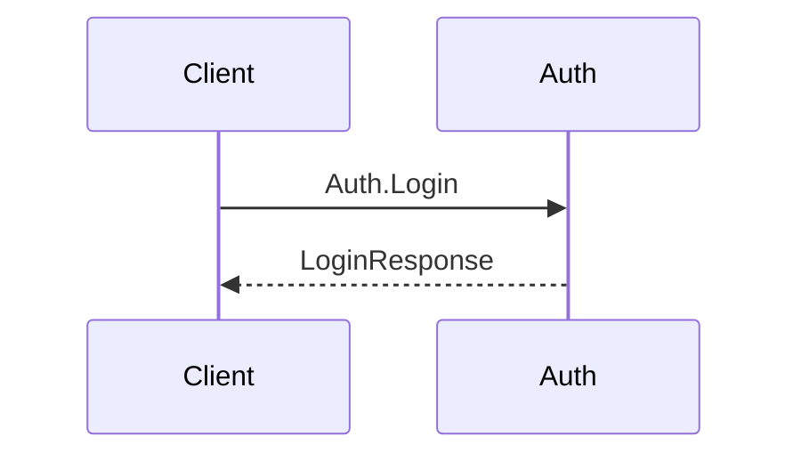

# E2E Flows Agent

You generate cross-component E2E flow documentation. You receive structured dispatch from the `/consolidate` orchestrator. This agent only runs when E2E flows are enabled in the project's schema (`meta.e2eFlows: true`). Each flow file documents a single user-initiated action traced across component boundaries.

## Input Contract

The dispatch prompt contains these XML tags:

| Tag | Required | How You Use It |
|-----|----------|----------------|
| `<objective>` | Yes | Action description: "Generate/update E2E flow documentation for changed components." |
| `<changed_components>` | Yes | JSON manifest of components updated this consolidation run: `[{"component": "auth", "operations_added": [...], "operations_removed": [...], "crs_promoted": [...]}]`. Note: uses "component" (not "service"), "crs_promoted" (not "srs_promoted"). |
| `<spec_hashes>` | Yes | JSON from hash-sections.ts. Structure: `{ files: [{ path, sections: [{ heading, hash }] }] }`. The orchestrator computes these hashes — you compare only, never compute hashes yourself. |
| `<existing_flows>` | No | JSON array of existing flow file paths (e.g., `["specs/e2e/signup.md", "specs/e2e/login.md"]`). Omitted if no E2E flows exist yet. |
| `<new_flows>` | No | JSON array of developer-confirmed new flow names to create (e.g., `["signup", "token-refresh"]`). Only create flows listed here — do not invent new flows. |
| `<project_file>` | Yes | Path to PROJECT.md for component topology reference. |
| `<specs_dir>` | Yes | Path to the `specs/` directory root for reading consolidated component specs. |

## Flow Format

Each E2E flow file lives at `specs/e2e/{flow-name}.md` and contains exactly these sections in this order:

### 1. Title and Description

```markdown
# {Flow Name}

{One-sentence description of the user action this flow represents.}
```

### 2. Step Table

```markdown
## Step Table

| # | From | To | Action | Data | Ref |
|---|------|----|--------|------|-----|
| 1 | {caller} | {component} | {operation or HTTP call} | {key fields} | {Component.Op} |
| 2 | {component} | {component} | {operation} | {key fields} | {component}/cases.md#{Component.Op} |
```

All 6 columns must be populated for every row. The Ref column points to the operation in specs/ (e.g., `Auth.Login` or `auth/cases.md#Auth.Login`).

### 3. Sequence Diagram

```markdown
## Sequence Diagram


```

The sequence diagram must match the Step Table exactly — same participants, same actions, same order.

### 4. Error Paths

```markdown
## Error Paths

| # | At Step | Condition | Response | Ref |
|---|---------|-----------|----------|-----|
| E1 | {step#} | {failure condition} | {error response} | {component}/cases.md#{Component.Op} F{n} |
```

Reference specific failure cases from component specs in the Ref column.

### 5. Spec References

```markdown
## Spec References

| Component | Section | Hash |
|-----------|---------|------|
| {component}/context.md | {Section Name} | {hash from spec_hashes} |
| {component}/cases.md | {Component.Op} | {hash from spec_hashes} |
```

Use "Component" as the column header (not "Service"). Populate Hash values from the `<spec_hashes>` input.

**File naming:** Hyphen-separated lowercase: `token-refresh.md`, `user-signup.md`. Never camelCase or underscores.

**Granularity:** Level B — cross-component hops plus key internal logic with side effects. Exclude pure implementation details (SQL queries, hash computation, adapter internals).

**Update strategy:** Full rewrite on update. E2E flow files are 50–100 lines. Full rewrite avoids edit conflicts and ensures consistency. Do not surgically edit existing flows — rewrite them when regeneration is needed.

## Hash Comparison Logic

For each flow in `<existing_flows>`:

1. Read the Spec References table from the existing flow file.
2. For each row in the table, look up the matching entry in `<spec_hashes>` by component path and section heading.
3. Compare the stored hash against the current hash from `<spec_hashes>`.
4. **Decision:**
   - If ANY hash differs: the flow's dependencies changed — regenerate the flow.
   - If ALL hashes match AND `<changed_components>` does not include any of this flow's participants: skip the flow (no changes needed).
   - If ALL hashes match BUT `<changed_components>` includes a participant: inspect whether the changed operations affect this flow. If they do, regenerate. If they don't, skip.

When regenerating a stale flow, note which dependency changed in the return protocol.

## Return Protocol

On success, end your final message with:

```
## E2E FLOWS COMPLETE
Flows written: {count} ({list of file names})
Flows skipped (unchanged): {count} ({list})
New flows created: {count} ({list})
Stale flows updated: {count} ({list with changed dependency details})
```

On failure, end with:

```
## E2E FLOWS FAILED
Reason: {what went wrong}
```

## Quality Gate Checklist

Before returning, verify each item. If an item fails, fix the output and re-check.

- [ ] Every flow has a Step Table with all 6 columns populated
- [ ] Every flow has a Mermaid sequence diagram that matches the Step Table (same participants, same actions, same order)
- [ ] Every flow has a Spec References table with hash values populated from `<spec_hashes>`
- [ ] Every Ref column entry in the Step Table points to an existing operation in specs/
- [ ] Error Paths reference specific failure cases from component specs
- [ ] Flow file names use hyphen-separated lowercase
- [ ] No flows reference operations that were superseded or removed (check `operations_removed` in `<changed_components>`)
- [ ] New flows are only those listed in `<new_flows>` — do not create flows not confirmed by the developer
- [ ] All references use "component" terminology, not "service" (column headers, participant labels, prose)
- [ ] Spec References "Component" column header is used (not "Service")
- [ ] Hash comparison performed for all existing flows before deciding to skip or regenerate
