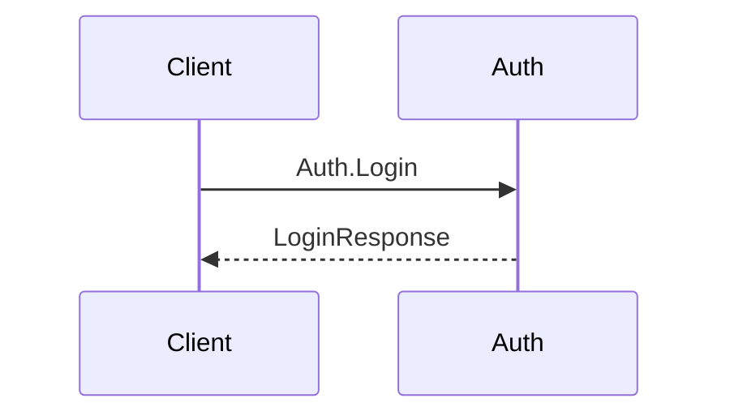

# Consolidate v2 -- Implementation Spec

> **Note:** This document is a reference during the transition period (Phases 11-14). It will be deleted after Phase 14 when all content has transferred to deliverables.

## Overview

Consolidate v2 is a Claude Code skill (`/consolidate`) that transforms phase-scoped planning decisions into per-component specification files after a phase ships. It replaces the never-executed v1 skill (`/consolidate-specs`).

**What it does:** Reads a shipped phase's CONTEXT.md and CASES.md, parses a schema file to discover components and section structures, dispatches parallel subagents to write per-component spec files (`specs/{component}/context.md` + `cases.md`), optionally generates cross-component E2E flow documentation (`specs/e2e/{flow}.md`), runs a verification pass, and presents a confirmation summary to the developer before committing.

**Where it lives:** A separate Claude Code plugin project (not embedded in the application project). The skill definition, agent definitions, hash tool, and schema tools are all part of this plugin. They depend on GSD conventions (CONTEXT.md, ROADMAP.md, phase directory structure, PROJECT.md) but are technology-neutral and project-neutral. No component names or project-specific terminology is hardcoded.

**Relationship to GSD workflow:** The developer manually invokes `/consolidate {phase-number}` after a phase ships. There is no integration with `/gsd:next` -- the developer decides when to consolidate.

**Output location (in the host project):**
```
.planning/specs/
  {component}/
    context.md       -- design decisions, architecture, configuration
    cases.md         -- rules, S/F/E tables, error categories
  e2e/
    {flow-name}.md   -- per-user-action cross-component flows (opt-in)
  INDEX.md           -- component table + E2E table + operation index
```

## File Inventory

All paths are relative to the plugin project root. The plugin project's directory structure mirrors the `.claude/` layout that gets installed into host projects.

| # | Path | Purpose |
|---|------|---------|
| 1 | `skills/consolidate/SKILL.md` | Orchestrator skill (7+2 step schema-driven pipeline) |
| 2 | `agents/spec-consolidator.md` | Per-component consolidation agent (sonnet) |
| 3 | `agents/e2e-flows.md` | Cross-component E2E flow agent (sonnet) |
| 4 | `agents/spec-verifier.md` | Verification agent (opus, read-only) -- Phase 13 |
| 5 | `tools/hash-sections.ts` | Deno SHA-256 section hashing |
| 6 | `tools/hash-sections_test.ts` | Hash tool tests |
| 7 | `tools/schema-parser.ts` | Deno schema file parser |
| 8 | `tools/schema-parser_test.ts` | Schema parser tests |
| 9 | `tools/schema-bootstrap.ts` | Deno starter schema generator |
| 10 | `tools/schema-bootstrap_test.ts` | Bootstrap tool tests |

**Host project artifacts created at runtime** (not in the plugin project):
- `.planning/specs/{component}/context.md` -- per component
- `.planning/specs/{component}/cases.md` -- per component
- `.planning/specs/e2e/{flow-name}.md` -- per user action (when E2E flows enabled)
- `.planning/specs/INDEX.md` -- updated each run
- `.planning/consolidation.schema.md` -- component registry and section configuration (created once by developer)

Section structure is defined in the project's consolidation schema file. See `docs/MODEL.md` for the default section structure and override mechanism.

## Hash Tool

### `hash-sections.ts`

**Purpose:** Deterministic SHA-256 section hashing for E2E flow dependency tracking. Computes a truncated hash for each H2 section in a markdown file.

**Why a dedicated tool:** Agent inline hash computation was explicitly rejected due to non-deterministic normalization (logic lives in agent reasoning, varies between runs), 3-5x token cost, and shell escaping fragility with rich markdown content.

**Dependencies:** `npm:unified@11.0.5`, `npm:remark-parse@11.0.0` (pin to these versions or latest stable at implementation time). Uses AST-based H2 section extraction -- the parser handles all markdown edge cases (tilde fences, backtick fences, setext headers, ATX trailing hashes) automatically.

**Why npm packages instead of manual parsing:** The unified/remark-parse AST approach eliminates the need to manually handle fenced code block toggling, setext headers, and other CommonMark edge cases. The parser is battle-tested; ~40 lines of manual regex parsing with edge case handling is replaced by robust AST traversal.

**Network requirement:** First Deno run downloads npm packages from the registry. Subsequent runs use the Deno cache (`DENO_DIR`). The `--no-remote` flag CANNOT be used because npm packages require network fetch on first invocation. Document this requirement in the skill's installation/setup notes.

**Invocation:**
```bash
deno run --no-lock --allow-read tools/hash-sections.ts <file1.md> [file2.md ...]
```

**Input:** One or more markdown file paths as CLI arguments.

**Output:** JSON to stdout:
```json
{
  "files": [
    {
      "path": "specs/auth/context.md",
      "sections": [
        { "heading": "Domain Model", "hash": "a3f8c2e1" },
        { "heading": "Adapter Contracts", "hash": "c5f0e4a3" }
      ]
    }
  ]
}
```

**Algorithm:**
1. Parse the markdown file into an AST using `unified` + `remark-parse`.
2. Extract H2 sections: each section starts at an H2 node and includes all content (including nested H3/H4) until the next H2 or end of file. The H2 heading line itself IS included in the hashable content.
3. For each section, serialize the AST nodes back to markdown text.
4. Normalize: strip trailing whitespace per line, collapse consecutive blank lines to a single blank line, normalize line endings to LF. No formatting normalization (bold/code markup changes produce hash changes -- this is an acceptable false positive, not a false negative).
5. Compute SHA-256 of the normalized UTF-8 bytes using Deno's Web Crypto API (`crypto.subtle.digest`).
6. Truncate to first 8 hex characters.
7. Emit JSON to stdout.

**Pre-first-H2 content:** Metadata before the first H2 header (e.g., `Last consolidated:` line) is excluded from hashing. It is not a section.

### `hash-sections_test.ts`

**Test runner:** `deno test --allow-read`

**Test cases:**

| # | Test | Validates |
|---|------|-----------|
| 1 | Basic H2 extraction | Two H2 sections correctly identified, content includes nested H3 |
| 2 | Code block inside section | Fenced code block with `## fake heading` inside does not create a false section boundary |
| 3 | Tilde fence handling | `~~~` fenced blocks handled identically to backtick fences |
| 4 | Normalization: trailing whitespace | `"text  \n"` and `"text\n"` produce the same hash |
| 5 | Normalization: consecutive blank lines | 3 blank lines collapsed to 1 produce the same hash as a single blank line |
| 6 | Determinism | Same input produces same output across 10 consecutive runs |
| 7 | JSON output format | Output parses as valid JSON matching the schema above |
| 8 | Header included in hash | Renaming an H2 heading changes the hash (proves header is hashed) |
| 9 | Empty section | An H2 with no content below it produces a valid (short) hash |
| 10 | Multiple files | Two file paths produce a `files` array with two entries |

## Agent: spec-consolidator

### Frontmatter

```yaml
name: spec-consolidator
description: >
  Consolidates phase planning decisions into per-component spec files.
  Reads phase CONTEXT.md and CASES.md, merges with existing specs,
  writes updated specs/{component}/context.md and cases.md.
  Evaluates conditional sections from schema against phase documents.
tools:
  - Read
  - Grep
  - Glob
  - Write
model: sonnet
```

### Input Contract (XML dispatch tags)

| Tag | Required | Contents |
|-----|----------|----------|
| `<objective>` | Yes | "Consolidate Phase {id} decisions for {component} into specs/{component}/." |
| `<component>` | Yes | Component name (lowercase) |
| `<sections>` | Yes | JSON array of `{ name, guide }` objects -- the explicit section list for context.md. Agent produces exactly these sections in this order. |
| `<conditional_sections>` | Yes | JSON array of `{ name, condition }` objects for agent evaluation against phase documents. Pass `[]` when no conditional sections apply. |
| `<rule_prefix>` | Yes | Prefix to use when promoting PR rules (e.g., "CR"). |
| `<files_to_read>` | Yes | Ordered list of file paths: phase CONTEXT.md, CASES.md, PROJECT.md. Read all before writing output. |
| `<existing_spec>` | No | Path to existing `specs/{component}/context.md`. Omitted for new components. |
| `<existing_cases>` | No | Path to existing `specs/{component}/cases.md`. Omitted for new components. |
| `<output_context>` | Yes | Output file path for `specs/{component}/context.md`. |
| `<output_cases>` | Yes | Output file path for `specs/{component}/cases.md`. |
| `<phase_id>` | Yes | Phase identifier string (e.g., `3A`, `02`) for provenance tags. |
| `<superseded_operations>` | No | JSON array of `{"old": "Component.Op", "replacement": "..."}` from CASES.md Superseded Operations table. Omitted if no supersessions. |
| `<superseded_rules>` | No | JSON array of `{"phase": "XX", "rule_id": "PR-N", "reason": "..."}` from CASES.md Superseded Rules table. Omitted if no supersessions. |

### Merge Rules

Follow all 11 rules exactly. These are non-negotiable.

1. **Operation-level replacement:** When a later phase re-specifies an operation (same `{Component}.{Op}` heading), the entire operation section (rules, side effects, cases table) replaces the prior version in the consolidated spec. No case-level merge -- the /case workflow produces complete per-operation specs.

2. **PR to CR promotion:** ALL Phase Rules (PR-N) from the source phase CASES.md are mechanically promoted to Component Rules using the `<rule_prefix>` value (e.g., CR-N). This is a mechanical rename -- no judgment, no filtering. Renumber sequentially from the highest existing component rule number + 1. If no existing rules exist, start from 1.

3. **TR exclusion:** Temp Rules (TR-N) from the source phase CASES.md are skipped entirely. They never enter specs/. If no TR entries exist, this rule is a no-op.

4. **R to OR transformation:** Operation Rules labeled `R-N` in the source CASES.md are renamed to `OR-N` in the consolidated output. This is a consolidation-time output transformation -- the source CASES.md is never modified.

5. **GR reference only:** Global Rules (GR-XX, defined in PROJECT.md) are referenced with `See GR-XX` notation. Never duplicated into specs/.

6. **Superseded operations:** For each entry in `<superseded_operations>`, remove the old operation section from the existing spec. The Replacement column is for developer reference only -- the consolidator's job is removal, not substitution.

7. **Superseded rules:** For each entry in `<superseded_rules>`, skip the referenced PR during CR promotion. The Phase+ID reference enables fully mechanical skip -- no semantic matching needed.

8. **Section-level rewrite for context.md:** For each schema-defined section (from `<sections>`), if the new phase has content for that section, rewrite the entire section with merged content (latest wins). If the new phase has no content for a section, leave the existing section unchanged.

9. **Provenance:** Every rule and significant decision entry includes `(Source: Phase {id})` or `(Source: Phase {id} D-{n})` inline provenance.

10. **Forward Concerns exclusion:** Forward Concerns from CASES.md are never consolidated into specs/. They remain in phase CASES.md only.

11. **Exclusions from specs/:** Infrastructure setup, testing strategy, discussion rationale, research findings, planning artifacts (task decomposition, execution order).

### Return Protocol

On success:
```
## CONSOLIDATION COMPLETE
Component: {component}
Files written: specs/{component}/context.md, specs/{component}/cases.md
Operations: {count}
New {prefix}s promoted: {count} (from PR-N: {list})
Superseded operations removed: {count} ({list})
Superseded rules skipped: {count} ({list})
Conditional sections: included: {list} / excluded: {list}
```

On failure:
```
## CONSOLIDATION FAILED
Component: {component}
Reason: {what went wrong}
```

### Quality Gate Checklist

Before returning, the agent verifies each item. If an item fails, the agent fixes the output and re-checks.

- [ ] All operations from phase CASES.md present in output (unless superseded)
- [ ] All operations use `{Component}.{Op}` naming format (never `{service}.{Op}` or any variant)
- [ ] Every rule and decision entry has `(Source: Phase {id})` provenance tag
- [ ] No empty sections (sections with no content are omitted, not left empty)
- [ ] GR rules referenced only (`See GR-XX`), never content-duplicated
- [ ] PR mechanically promoted to {prefix}-N with sequential numbering from highest existing {prefix} + 1
- [ ] TR entries skipped (not present in output)
- [ ] R entries renamed to OR in output
- [ ] Forward Concerns not present in output
- [ ] Superseded operations removed from existing spec
- [ ] Superseded rules skipped during CR promotion
- [ ] Sections match the `<sections>` list exactly -- no extra sections, no missing mandatory sections
- [ ] Conditional section evaluation logged as HTML comments (both inclusions and exclusions)
- [ ] `Last consolidated: Phase {id} (YYYY-MM-DD)` header updated with actual date
- [ ] No service-biased language in output (no "service" terminology, no fixed category names)

## Agent: e2e-flows

### Frontmatter

```yaml
name: e2e-flows
description: >
  Generates or updates cross-component E2E flow documentation.
  Reads consolidated component specs and produces per-user-action flow files
  with step tables, Mermaid diagrams, and spec reference hashes.
tools:
  - Read
  - Grep
  - Glob
  - Write
model: sonnet
```

### Input Contract (XML dispatch tags)

| Tag | Required | Contents |
|-----|----------|----------|
| `<objective>` | Yes | "Generate/update E2E flow documentation for changed components." |
| `<changed_components>` | Yes | JSON manifest of components updated this run: `[{"component": "auth", "operations_added": [...], "operations_removed": [...], "crs_promoted": [...]}]`. Uses "component" (not "service"), "crs_promoted" (not "srs_promoted"). |
| `<spec_hashes>` | Yes | JSON from hash-sections.ts: `{ files: [{ path, sections: [{ heading, hash }] }] }`. The orchestrator computes these hashes -- the agent compares only, never computes. |
| `<existing_flows>` | No | JSON array of existing E2E flow file paths: `["specs/e2e/signup.md", "specs/e2e/login.md"]`. Omitted if no E2E flows exist yet. |
| `<new_flows>` | No | JSON array of developer-confirmed new flow names to create: `["signup", "token-refresh"]`. Only create flows listed here. |
| `<project_file>` | Yes | Path to PROJECT.md for component topology reference. |
| `<specs_dir>` | Yes | Path to `specs/` directory root for reading consolidated component specs. |

### Flow Format

Each E2E flow file (`specs/e2e/{flow-name}.md`) contains exactly these sections in this order:

```markdown
# {Flow Name}

{One-sentence description of the user action this flow represents.}

## Step Table

| # | From | To | Action | Data | Ref |
|---|------|----|--------|------|-----|
| 1 | {caller} | {component} | {operation or call} | {key fields} | {Component.Op} |
| 2 | {component} | {component} | {operation} | {key fields} | {component}/cases.md#{Component.Op} |

## Sequence Diagram



## Error Paths

| # | At Step | Condition | Response | Ref |
|---|---------|-----------|----------|-----|
| E1 | {step#} | {failure condition} | {error response} | {component}/cases.md#{Component.Op} F{n} |

## Spec References

| Component | Section | Hash |
|-----------|---------|------|
| {component}/context.md | {Section Name} | {hash from spec_hashes} |
| {component}/cases.md | {Component.Op} | {hash from spec_hashes} |
```

**Column header:** Use "Component" in the Spec References table (not "Service").

**File naming:** Hyphen-separated lowercase: `token-refresh.md`, `user-signup.md`. Never camelCase or underscores.

**Granularity:** Level B -- cross-component hops plus key internal logic with side effects. Exclude pure implementation details (SQL queries, hash computation, adapter internals).

**Update strategy:** Full rewrite on update. E2E flow files are 50-100 lines. Full rewrite avoids edit conflicts and ensures consistency. Do not surgically edit existing flows.

### Hash Comparison Logic

For each flow in `<existing_flows>`:

1. Read the Spec References table from the existing flow file.
2. For each row in the table, look up the matching entry in `<spec_hashes>` by component path and section heading.
3. Compare the stored hash against the current hash.
4. **Decision:**
   - If ANY hash differs: the flow's dependencies changed -- regenerate the flow.
   - If ALL hashes match AND `<changed_components>` does not include any of this flow's participants: skip the flow (no changes needed).
   - If ALL hashes match BUT `<changed_components>` includes a participant: inspect whether the changed operations affect this flow. If they do, regenerate. If they don't, skip.

### Return Protocol

On success:
```
## E2E FLOWS COMPLETE
Flows written: {count} ({list of file names})
Flows skipped (unchanged): {count} ({list})
New flows created: {count} ({list})
Stale flows updated: {count} ({list with changed dependency details})
```

On failure:
```
## E2E FLOWS FAILED
Reason: {what went wrong}
```

### Quality Gate Checklist

- [ ] Every flow has a Step Table with all 6 columns populated
- [ ] Every flow has a Mermaid sequence diagram that matches the Step Table (same participants, same actions, same order)
- [ ] Every flow has a Spec References table with hash values populated from `<spec_hashes>`
- [ ] Every Ref column entry in the Step Table points to an existing operation in specs/
- [ ] Error Paths reference specific failure cases from component specs
- [ ] Flow file names use hyphen-separated lowercase
- [ ] No flows reference operations that were superseded or removed (check `operations_removed` in `<changed_components>`)
- [ ] New flows are only those listed in `<new_flows>` -- do not create flows not confirmed by the developer
- [ ] All references use "component" terminology, not "service" (column headers, participant labels, prose)
- [ ] Spec References "Component" column header is used (not "Service")
- [ ] Hash comparison performed for all existing flows before deciding to skip or regenerate

## Agent: spec-verifier

> **Phase 13 deliverable.** The SKILL.md Step 5 includes a skip branch that activates when `agents/spec-verifier.md` is absent. When Phase 13 creates the verifier, Step 5 activates automatically.

### Frontmatter

```yaml
name: spec-verifier
description: >
  Verifies consolidated spec files for syntactic correctness, cross-component
  consistency, and compliance with consolidation rules. Read-only: never
  modifies spec files. Returns structured findings.
tools:
  - Read
  - Grep
  - Glob
model: opus
maxTurns: 15
```

**Why opus:** L2 checks require nuanced cross-component reasoning (e.g., V-28 CR keyword overlap detection). Start with opus; downgrade to sonnet if L2 findings rarely fire after several real consolidation runs.

**Why maxTurns: 15:** Expected 10-12 turns (5-8 file reads + reasoning + structured output). 15 provides margin without allowing runaway loops.

**No Write tool:** The verifier is read-only by design. Findings are ephemeral -- included in the orchestrator's confirmation summary only, never persisted to a file.

### Input Contract (XML dispatch tags)

| Tag | Required | Contents |
|-----|----------|----------|
| `<objective>` | Yes | "Verify consolidated specs for Phase {id}. Check all 28 verification items." |
| `<specs_dir>` | Yes | Path to `specs/` directory root |
| `<index_file>` | Yes | Path to `specs/INDEX.md` |
| `<phase_id>` | Yes | Phase identifier being verified |
| `<phase_cases_file>` | No | Path to source phase CASES.md (for V-14 PR count verification). Omitted for Phase 1 backfill. |
| `<project_file>` | Yes | Path to PROJECT.md (for V-25 GR reference validity, V-26 no GR duplication, V-27 component registry match) |
| `<changed_components>` | Yes | JSON manifest from consolidator results (same structure as E2E agent input) |
| `<e2e_dir>` | No | Path to `specs/e2e/` directory. Omitted if no E2E flows exist. |

### Return Protocol

On success:
```
## VERIFICATION COMPLETE

### Tier 1 Findings (block confirmation)
{numbered list, or "None."}

### Tier 2 Findings (developer decides)
{numbered list, or "None."}

### Tier 3 Findings (informational)
{numbered list, or "None."}

### Human-Only Checks (not automated)
{checklist for developer manual review}

Summary: T1={count} T2={count} T3={count} | Verdict: {PASS / FINDINGS}
```

On failure:
```
## VERIFICATION FAILED
Reason: {what went wrong}
```

### Quality Gate Checklist

- [ ] All 28 verification checks executed (or explicitly noted as not applicable with reason)
- [ ] Each finding references specific file path and line/section
- [ ] Findings correctly classified into tiers (T1/T2/T3/Human)
- [ ] No false positives from Phase 1 backfill (context.md only, no cases.md expected)
- [ ] V-09 (no fabricated cases) explicitly checked and reported
- [ ] V-14 (PR to CR count) uses delta comparison against source CASES.md
- [ ] V-25/V-26/V-27 checked against PROJECT.md
- [ ] V-29 checked for E2E Spec References validity (if E2E flows exist)

## SKILL.md -- Orchestrator

### Frontmatter

```yaml
name: consolidate
description: >
  Consolidate a shipped phase's decisions into per-component spec files.
  Reads schema for component registry and section structures, dispatches
  parallel consolidation agents, generates E2E flows when enabled, runs
  verification. Triggers: after ship, spec consolidation, phase completed.
argument-hint: "[phase-number]"
allowed-tools:
  - Agent
  - Bash
  - Read
  - Write
  - Glob
  - Grep
  - AskUserQuestion
disable-model-invocation: true
```

**Why `disable-model-invocation: true`:** Prevents subagents from invoking other skills. Compatible with Agent dispatch -- the flag only prevents the model from autonomously triggering skill execution, not from the orchestrator dispatching agents.

**Why `Agent` in allowed-tools:** Required for subagent dispatch (spec-consolidator, e2e-flows, spec-verifier).

**Why `Bash` in allowed-tools:** Required for invoking the Deno tools (schema-parser.ts, hash-sections.ts).

### Pipeline (7+2 Steps)

#### Step 1: Read Phase Documents, Parse Schema, Discover Components

**Input:** Phase number from skill argument.

**Actions:**
1. Resolve phase directory: `find .planning/phases -maxdepth 1 -type d -name "${PHASE}*"`
2. Check for `.planning/consolidation.schema.md`. If missing, offer bootstrap:
   ```bash
   deno run --allow-read --allow-write tools/schema-bootstrap.ts .planning/consolidation.schema.md
   ```
   After bootstrap, ask the developer to populate the Components table, then re-parse.
3. Parse schema:
   ```bash
   deno run --allow-read tools/schema-parser.ts .planning/consolidation.schema.md
   ```
   Extract from JSON stdout:
   - `meta.e2eFlows` (boolean) -- store for Steps 3.5/4 gating
   - `meta.rulePrefix` (string, e.g., "CR") -- use for rule promotion prefix
   - `components[]` -- component registry: `{ name, description, type }`
   - `sections` -- section structure map: `Record<string, { context[], conditional[] }>`

   Resolve section structure per component:
   - If `component.type` is non-empty → use `sections[component.type]`
   - If `component.type` is empty → use `sections["default"]`

4. Read phase documents in priority order (later overrides earlier):
   - `{phase_dir}/{padded}-CONTEXT.md` -- primary decision source
   - `{phase_dir}/{padded}-CASES.md` -- behavioral specs, rules
   - `{phase_dir}/CASE-SCRATCH.md` -- only if CASES.md does not exist (pre-finalization fallback)
5. Read `.planning/PROJECT.md` for GR references.
6. Discover affected components using the 2-step algorithm (see below).
7. Read existing spec files if they exist (`specs/{component}/context.md`, `specs/{component}/cases.md`).
8. **Out-of-order consolidation check:** For each affected component with an existing spec, compare the spec's `Last consolidated: Phase {id}` against the source phase ID. If the source phase is chronologically older, WARN (do not block): "Warning: {component} spec was last consolidated from a newer phase. Proceeding may overwrite newer content."

**Component discovery algorithm (2-step, no keyword fallback):**

1. **Operation headings:** Scan CASES.md (or CASE-SCRATCH.md) for `## {Component}.{Op}` heading patterns. Extract unique component names from the prefix before the dot.

2. **Component names in CONTEXT.md:** If Step 1 yields zero components, scan CONTEXT.md for component names matching schema `components[].name`.

3. **On miss:** AskUserQuestion -- "Could not identify affected components. Which components does this phase affect?"

Cross-reference discovered components against schema:
- In schema → proceed
- Not in schema → AskUserQuestion: "Component '{name}' discovered in phase documents but not in schema. Add to schema?" If confirmed, add a row to the schema Components table.

**Keyword fallback is explicitly rejected.** If operation headings and CONTEXT.md name scanning both miss, the phase document has a structural problem that keyword guessing would mask.

#### Step 2: Dispatch Per-Component Spec-Consolidator Agents (Parallel)

**Actions:**
1. For each affected component, build the dispatch prompt with all XML tags specified in the spec-consolidator input contract.
2. Extract `<superseded_operations>` and `<superseded_rules>` from the source CASES.md (if present).
3. Dispatch all agents in parallel using the Agent tool.
4. Collect return messages. Parse the `## CONSOLIDATION COMPLETE` or `## CONSOLIDATION FAILED` header from each.

**Error handling (fail-fast + selective retry):**
- If ANY agent returns `## CONSOLIDATION FAILED`: halt, report failure with context, offer:
  - **retry:** Re-dispatch the failed agent only. On retry success, proceed normally.
  - **abort:** `git checkout -- .planning/specs/`

#### Step 3: Collect Results, Update INDEX.md

**Actions:**
1. Parse each successful consolidator return for: component name, files written, operation count, promoted CRs (rule_prefix-N), applied supersessions.
2. Build `<changed_components>` manifest JSON.
3. Write `.planning/specs/INDEX.md` (fully rewritten each run -- not surgically edited):

```markdown
# Spec Index

Last updated: {YYYY-MM-DD}

## Components

| Component | Type | Description | Files | Last Consolidated |
|-----------|------|-------------|-------|-------------------|
| {name} | {type or empty} | {description} | [context]({name}/context.md) [cases]({name}/cases.md) | Phase {id} ({date}) |

## E2E Flows

| Flow | File | Participants | Last Updated |
|------|------|-------------|--------------|
{rows if any, or "No E2E flows."}

## Operation Index

| Operation | Component | Cases Source | Phase |
|-----------|-----------|-------------|-------|
| {Component}.{Op} | {component} | [cases.md]({component}/cases.md) | {id} |
```

Type column is always displayed -- leave empty for untyped components.

**Error handling:** INDEX.md write failure is non-fatal. Warn and proceed.

#### Step 3.5: Identify E2E Flows (Conditional)

Check `meta.e2eFlows` from Step 1.

- **If false:** Skip Steps 3.5 and 4 entirely. Log: "E2E flows disabled in schema. Skipping."
- **If true:** Proceed with flow discovery:
  1. Scan existing `specs/e2e/` for current flow files.
  2. For each changed component, check Dependencies section for cross-component references.
  3. New flow candidates → AskUserQuestion for confirmation: "New E2E flow candidates detected: {list}. Create these? (confirm / modify / skip)"
  4. Build `<existing_flows>` and `<new_flows>` lists.

#### Step 3.7: Orphan Directory Cleanup

1. Scan `specs/` for component directories not in the `<changed_components>` manifest.
2. For each, count operations in that component's spec files.
3. If 0 operations (all superseded/moved): flag as orphan candidate.
4. AskUserQuestion: "Orphan spec directories (0 operations): {list}. Remove?"
5. If confirmed: delete the directory.
6. Also offer to remove the component from the schema file. If confirmed: remove the row from the schema's Components table.

#### Step 4: Dispatch E2E Flows Agent (Conditional)

Only runs if `meta.e2eFlows` was true (checked in Step 3.5).

1. Verify Deno: `which deno`. If missing: report error, mark "E2E flows: SKIPPED", continue -- do NOT rollback component specs.
2. Compute section hashes for all spec files:
   ```bash
   deno run --no-lock --allow-read tools/hash-sections.ts {all spec files}
   ```
3. Parse hash JSON output: `{ files: [{ path, sections: [{ heading, hash }] }] }`.
4. Build dispatch prompt with XML tags for the e2e-flows agent (include `<existing_flows>`, `<new_flows>`, `<spec_hashes>`, `<phase_id>`).
5. Dispatch the e2e-flows agent (sequential, after Step 3).
6. Parse return.

**Error handling:** E2E agent failure does NOT rollback component spec consolidation. Mark "E2E flows: SKIPPED (agent failed)" in summary.

#### Step 5: Dispatch Spec-Verifier Agent (Conditional)

Check if `agents/spec-verifier.md` exists (use Glob).

- **Absent:** Log "Verification skipped (spec-verifier agent not yet created)". Mark output as "UNVERIFIED" in the confirmation summary.
- **Present:** Build dispatch prompt with full XML contract and dispatch the spec-verifier agent. Collect return: `## VERIFICATION COMPLETE` or `## VERIFICATION FAILED`.

**Error handling:** Verifier failure → mark "UNVERIFIED", proceed. Verifier is read-only: no rollback.

#### Step 6: Present Confirmation Summary

```
Phase {id} consolidation summary:

## Components Updated
{For each updated component:}
  - {component} ({type or "default"}): context.md + cases.md
    Operations: {count} ({list})
    New CRs promoted: {count} ({rule_prefix}-{list})
    Superseded operations removed: {count} ({list})

## Components Unchanged
  - {component}: no new decisions from this phase

## E2E Flows
  - Status: {OK / SKIPPED (reason) / DISABLED}
  {if enabled: Updated, Created, Skipped lists}

## Verification
  - Status: {PASS / FINDINGS / UNVERIFIED}
  {if findings: T1/T2/T3 lists}

## Orphan Directories
  - {list or "None."}

## Excluded (phase-contextual)
  - Infrastructure, Testing, Discussion
```

Present via AskUserQuestion: "Phase {id} consolidation ready. {N} components, {N} operations, {N} findings. Confirm commit?"

If T1 findings are present, warn: "T1 (must-fix) findings detected. Review before committing."

#### Step 7: Commit or Rollback

- **Confirmed:** Stage `.planning/specs/`, commit: `consolidate: Phase {id} -> specs/ ({component list})`
- **Rejected:** `git checkout -- .planning/specs/`. Report rollback.

### INDEX.md v2 Format

```markdown
# Spec Index

Last updated: {YYYY-MM-DD}

## Components

| Component | Type | Description | Files | Last Consolidated |
|-----------|------|-------------|-------|-------------------|
| auth | api | Authentication and token management | [context](auth/context.md) [cases](auth/cases.md) | Phase 3A (2026-XX-XX) |
| scheduler |  | Background job scheduler | [context](scheduler/context.md) [cases](scheduler/cases.md) | Phase 2 (2026-XX-XX) |

## E2E Flows

| Flow | File | Participants | Last Updated |
|------|------|-------------|--------------|
| Signup | [signup.md](e2e/signup.md) | auth, user | Phase 3A |

## Operation Index

| Operation | Component | Cases Source | Phase |
|-----------|-----------|-------------|-------|
| Auth.Login | auth | [cases.md](auth/cases.md) | 3A |
| Scheduler.EnqueueJob | scheduler | [cases.md](scheduler/cases.md) | 2 |
```

**Update rule:** Orchestrator rewrites INDEX.md entirely on each consolidation run. Not a surgical edit. Type column is always present even when empty.

## Rule Tier System

### Complete Hierarchy

| Prefix | Full Name | Location | Scope |
|--------|-----------|----------|-------|
| GR-XX | Global Rules | PROJECT.md | All components, all phases |
| CR-N | Component Rules | specs/{component}/cases.md | One component, permanent |
| OR-N | Operation Rules | specs/{component}/cases.md (within operation section) | One operation |
| PR-N | Phase Rules | Phase CASES.md (source only) | One phase, CR candidates |
| TR-N | Temp Rules | Phase CASES.md (source only) | One phase, temporary |

### What the Consolidator Does with Each Tier

| Tier | Consolidator Action |
|------|-------------------|
| GR | Reference only (`See GR-XX`). Never copy content. |
| CR | Already in specs/. Merge: latest wins per CR-N. |
| OR | Rename from R-N. Travel with their operation section during replacement. |
| PR | Mechanically promote ALL to CR. Sequential numbering from highest existing CR + 1. |
| TR | Skip entirely. Never enters specs/. |

### /case Skill Updates Needed (Separate Task)

1. **PR/TR distinction:** During step-discuss, when a rule is discovered, ask "Is this rule permanent (PR) or temporary/phase-scoped (TR)?" Initial classification in discuss, final confirmation in step-finalize with full PR/TR list review.
2. **Superseded Operations section:** When operation restructuring is discussed, /case produces a `## Superseded Operations` table with columns: Old Operation, Replacement, Reason. Replacement types: Renamed (`{Component}.{NewOp}`), Split (`{Op1} + {Op2}`), Merged (multiple rows with same new op), Moved (`{OtherComponent}.{Op}`), Removed (`Removed`).
3. **Superseded Rules section:** When rule revocation is discussed, /case produces a `## Superseded Rules` table with columns: Phase, Rule ID, Reason.
4. **OR prefix:** Future /case output uses OR-N natively instead of R-N.

## Verification Checks (28)

### Tier 1 -- Blocks Confirmation (Automated)

| ID | Description | Automation |
|----|-------------|------------|
| V-01 | Every rule and decision entry has `(Source: Phase {id})` provenance tag | Automated: grep for `Source: Phase` in all specs/ files |
| V-02 | No empty sections in any spec file | Automated: parse H2 sections, check for content |
| V-07 | INDEX.md Components table matches actual specs/ directory contents | Automated: compare INDEX.md entries vs `ls specs/` |
| V-08 | INDEX.md links resolve to existing files | Automated: check each `[text](path)` link |
| V-09 | No fabricated behavioral cases from CONTEXT.md (cases only from CASES.md source) | Automated: for components whose source phase has no CASES.md, verify cases.md does not exist or contains only CR references |
| V-16 | Latest-wins applied: no operation appears in two phases without the later phase's version winning | Automated: check provenance tags for duplicate operation headings |
| V-17 | Forward Concerns from CASES.md not present in specs/ | Automated: grep for "Forward Concern" or known forward-concern markers in specs/ |
| V-25 | GR references in specs/ resolve to actual PROJECT.md entries | Automated: extract `GR-XX` references from specs/, verify each exists in PROJECT.md |
| V-26 | specs/ does not duplicate GR content (only `See GR-XX` references allowed) | Automated: compare GR rule text in PROJECT.md against specs/ content; flag substantive duplication |
| V-29 | E2E Spec References validity -- all references in E2E flow files point to existing specs/ sections | Automated: parse Spec References tables in e2e/*.md, verify each Component+Section pair exists |

### Tier 2 -- Developer Decides (Semi-Automated)

| ID | Description | Automation |
|----|-------------|------------|
| V-05 | CR format consistency: all CRs follow `CR-N: {description} (Source: Phase {id})` | Semi-automated: regex match + human review of edge cases |
| V-10 | Cross-component operation references resolve: if auth/cases.md mentions `User.CreateUser`, it exists in user/cases.md | Semi-automated: extract cross-component refs, verify targets exist |
| V-11 | Component routes resolve: every route in a component's context.md references a valid operation | Semi-automated: parse route table, check operation refs |
| V-14 | All PRs promoted to CR: count PRs in source phase CASES.md, count new CRs in specs/ attributed to that phase (via provenance tags). Delta comparison, not total count. | Semi-automated: count + compare |
| V-15 | Error categories consistent across components: same error type uses same identifier | Semi-automated: extract error category tables, cross-compare |
| V-18 | Backfill provenance: context.md entries from backfilled phases have correct phase attribution | Semi-automated: check provenance tags against expected phase range |
| V-27 | specs/ component list matches schema registry (no phantom components, no missing components that should have specs) | Semi-automated: compare specs/ dirs vs schema Components table |
| V-28 | CR keyword overlap detection: flag CR pairs mentioning same operation/error keywords (catches contradicting PRs promoted to CR without supersession) | Semi-automated: NLP-light keyword extraction + human review |

### Tier 3 -- Informational

| ID | Description | Automation |
|----|-------------|------------|
| V-03 | Operation names follow `{Component}.{Op}` PascalCase format | Automated: regex check |
| V-04 | Schema-defined sections present: context.md contains the sections declared in the schema for this component's type | Automated: check H2 headings against schema section list |
| V-06 | No phase-contextual content (infrastructure setup, testing strategy, discussion rationale) | Semi-automated: keyword scan for infrastructure/testing terms |
| V-12 | INDEX.md has no stale entries (operations listed but not in spec files) | Automated: cross-reference INDEX Operation Index vs spec file contents |
| V-13 | INDEX.md attribution: phase numbers in Operation Index match provenance tags in spec files | Automated: compare INDEX phase column vs spec provenance |
| V-19 | Shared type consistency: same entity referenced across components uses consistent field names | Semi-automated: extract entity definitions, cross-compare |

### Human-Only Checks (Not Automatable)

| ID | Description |
|----|-------------|
| V-20 | Semantic correctness: consolidated spec accurately represents the phase decisions |
| V-21 | Completeness: no significant decisions from CONTEXT.md omitted |
| V-22 | Classification: operations assigned to correct components |
| V-23 | Consumer behavior: case-briefer would produce correct results reading these specs |
| V-24 | E2E accuracy: flow steps match actual intended system behavior |

## Consumer Updates

### case-briefer

**Change:** Steps 4.6 and 4.7 update to read specs/ first, with phase directory fallback.

**Lookup order:**
1. Check `specs/{component}/cases.md` for the referenced operation.
2. If found, use it as the authoritative source.
3. If not found (component not yet consolidated, or operation from an in-progress phase), fall back to scanning phase directories as currently implemented.

**Forward Concerns:** ALWAYS read from phase CASES.md (never from specs/). Forward Concerns are phase-scoped, not component-scoped. The fallback to phase directories is permanent for Forward Concerns -- they never enter specs/.

### case-validator

**Changes needed (separate task):**
1. TR recognized as a valid rule tier (do not flag TR-N as malformed)
2. OR recognized as a valid rule tier (do not flag OR-N as malformed)
3. Superseded Operations and Superseded Rules recognized as valid CASES.md sections
4. Grep patterns updated to match OR prefix in addition to R prefix

### CLAUDE.md Snippet Template for Host Projects

After the first consolidation run, add to the host project's CLAUDE.md (or equivalent project instructions file):

```markdown
## Spec Consolidation

Per-component specs live in `.planning/specs/`. After each phase ships, run `/consolidate {phase-number}` to update specs.

**Reading priority for phase planning:**
- `specs/{component}/context.md` for existing component decisions (preferred)
- Phase `CONTEXT.md` for in-progress or newly scoped work
- `specs/e2e/{flow}.md` for cross-component flow understanding

**Never modify specs/ files manually.** Always use `/consolidate`.
```

## Backfill Strategy

When consolidating a phase for a component that has no prior consolidated history, check whether earlier phases produced decisions about this component. If so, backfill those decisions into the new spec file before adding the current phase's content.

**To identify backfill candidates:** Scan `.planning/phases/` for CONTEXT.md and CASES.md files that reference this component by name (using `{Component}.{Op}` heading patterns). Present the list to the developer: "Earlier phase decisions found for {component}: {phase list}. Backfill these into the new spec?" Backfill each confirmed phase via a separate consolidator dispatch before processing the current phase.

Backfill applies to new files only -- existing files are updated incrementally by the normal merge process.

## Resolved Review Items

| ID | Finding | Resolution |
|----|---------|------------|
| A1 | Hash computation ownership | Orchestrator computes hashes via Deno script (Bash tool), passes JSON to E2E agent as `<spec_hashes>`. E2E agent compares only, never computes. |
| A2 | Deno script dependencies | Uses `npm:unified@11.0.5` + `npm:remark-parse@11.0.0` for AST-based parsing. `--no-remote` cannot be used (npm packages need network on first run). |
| A3 | Component classification | 2-step ONLY: operation headings > component names in CONTEXT.md. Keyword fallback rejected. Miss = error + developer specifies. |
| A4 | Phase 1 backfill output | context.md only for phases with no behavioral operations. No stub cases.md. Creating an empty stub would trigger V-09 false positives. |
| B2 | Verifier input contract missing PROJECT.md | PROJECT.md added to verifier dispatch input for V-25, V-26, V-27. |
| B3 | E2E agent I/O contract | Complete dispatch prompt XML tags defined: `<objective>`, `<changed_components>`, `<spec_hashes>`, `<existing_flows>`, `<new_flows>`, `<project_file>`, `<specs_dir>`. |
| B4 | V-14 PR to CR count verification needs delta comparison | Verifier counts PRs in source phase CASES.md and new CRs in specs/ attributed to that phase. Delta comparison, not total count. |
| B5 | Out-of-order consolidation warning | Orchestrator Step 1 checks existing spec's `Last consolidated: Phase {id}` vs source phase ID. Older source = warn, do not block. |
| C1 | Network dependency for Deno npm packages | Documented: first run downloads packages. `--no-remote` cannot be used. |
| C2 | Deno installation check | Orchestrator Step 4 runs `which deno` before hash computation. Missing Deno = skip E2E, do not rollback component specs. |
| D1 | Verifier error handling | Same fail-fast + retry as other agents. Retry fail = UNVERIFIED marking, proceed to confirmation. Verifier is read-only, no rollback needed. |
| D2 | Retry scope | Retry targets failed agent only. Abort triggers rollback of ALL specs/ changes (`git checkout -- .planning/specs/`). |
| D3 | Plugin project location | Skills and agents live in separate Claude Code plugin project, not in application project. |

## Open Questions

| # | Question | Status |
|---|----------|--------|
| 1 | **maxTurns calibration for spec-consolidator and e2e-flows:** Currently using defaults. Calibrate after first real consolidation run by observing actual turn counts. | Deferred to first usage |
| 2 | **Spec-verifier opus cost justification:** Start with opus for L2 nuanced checks. If L2 findings rarely fire after several consolidation runs, downgrade to sonnet. | Monitor after deployment |
