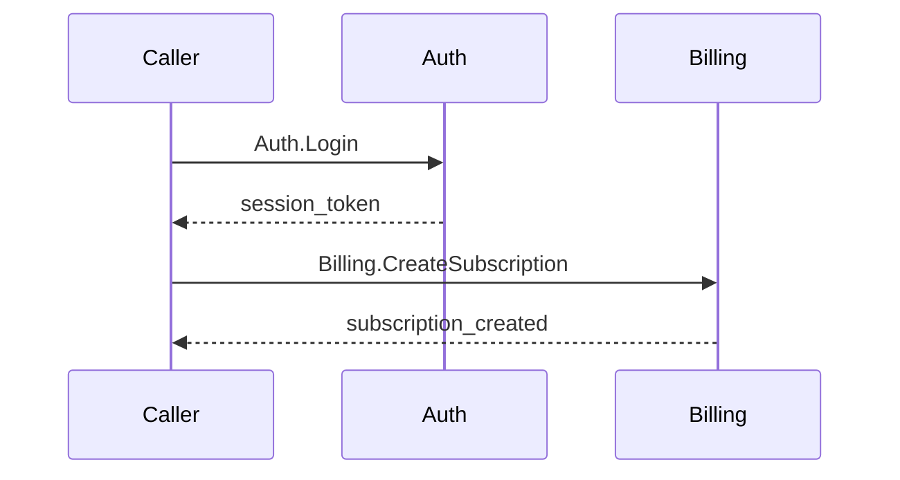

# Auth-Billing Flow

User creates a premium subscription requiring authentication and billing.

## Step Table

| # | From | To | Action | Data | Ref |
|---|------|----|--------|------|-----|
| 1 | caller | auth | Auth.Login | credentials | auth/cases.md#Auth.Login |
| 2 | auth | billing | Billing.CreateSubscription | user_id, plan | billing/cases.md#Billing.CreateSubscription |

## Sequence Diagram

## Error Paths

| # | At Step | Condition | Response | Ref |
|---|---------|-----------|----------|-----|
| E1 | 1 | Invalid credentials | invalid_credentials (InvalidCredentials) | auth/cases.md#Auth.Login F1 |
| E2 | 2 | Payment fails | payment_failed (PaymentFailed) | billing/cases.md#Billing.CreateSubscription F1 |

## Spec References

| Component | Section | Hash |
|-----------|---------|------|
| auth/context.md | Overview | 2f0f576f |
| auth/cases.md | Auth.Login | 2a3bdb65 |
| billing/context.md | Overview | 0dbef436 |
| billing/cases.md | Billing.CreateSubscription | b0f6db8e |
